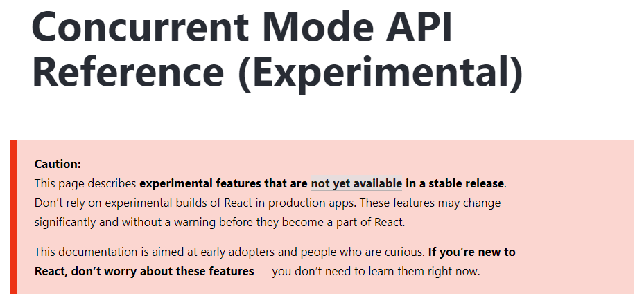

---?include=sections/cover.md
---?include=sections/intro.md

---

## The Last Few Years

- Fiber
- Functional Components
- Hooks

Note:
- Fiber: New algorithm, completely internal, reduced roadblocks in developing react
- Functional Components: Removed lifecycle methods, BUT made components easier to test, to reason about, and have better performance.
- Hooks: Re-connecting React features w/o classes. useEffect, useState, useContext, useReducer, useMemo, useRef

---

## The Real Reason You're Here

### Looking Forward

---

## The Real Reason You're Here

### App rewrites... again?

---

# The Goal

> "Apps should start fast and stay fast, regardless of device or network speed"

Note:
- True for FB scale or mom and pop scale
- 

---


Note:
- These are real issues

---

## Two Major Features

---

## Two Major Features

### 1. Concurrent Mode

Note:
- Current lifecycle is data driven.
- Async is a pain.
- "In Concurrent Mode, React can work on several state updates concurrently."

---

## Two Major Features

### 2. Suspense

Note:
- NOT a data fetching library
- Way for component to let React know that something is pending
- **Suspending** = the ability for a component let React know that it's waiting. 

---

## Who These Are For

- Early Adopters
- Tinkerers
- Library Authors
- Worriers

---

## Opt-In Only

Experimental builds only



---

## Opt-In Only

**Before:**
```
ReactDOM.render(<App />, document.getElementById('root'));
```

---

## Opt-In Only

**After:**
```
ReactDOM.createRoot(document.getElementById('root')).render(<App />);
```

Note:
- Strict mode strongly encouraged

---

## Grokking **Concurrent Mode**

Note:
- Helpful to understand the problem it's solving

---

## UX Problems

Note:
- Intermediate states feel like regressing
- Fail predictably

---

## Technical Problems

Note:
- With and without Version control in a team as metaphor
- Rendering pains due to blocking
- Lead into double buffering

---

## Technical Problems


Note:
- Jump out of the web and react world and into the graphics world
- Let's say you want to render a happy face on the screen. 
- Your display is constantly reading from your framebuffer - the list of all the data shown on your screen. Individual pixels.
- When you decide that you want to render an image, like an emoji, your computer updates the buffer.
- But before you're done with the data update, the display has outpaced you, meaning you get half an image, briefly.
- This is called "tearing", and it's no fun.

---

## To the Rescue


Note:
- Typing into a filterable list. Used to be solved with debounce
- Solved by moving rendering to be in memory

---

## Example

---

```js
function App() {
  const [resource, setResource] = useState(initialResource);
  const [startTransition, isPending] = useTransition({ timeoutMs: 3000 });

  return (
    <>
      <button disabled={isPending} onClick={() => {
        startTransition(() => {
          const nextUserId = getNextId(resource.userId);
          setResource(fetchProfileData(nextUserId));
        });
      }}>Next</button>

      {isPending ? " Loading..." : null}
      <ProfilePage resource={resource} />
    </>
  );
}
```
@[2]
@[3]
@[7]
@[8-11]
@[13]
@[14] But what about the loading state?

Note:
- This example is from the docs, so if curious, and they provide code-sandbox examples at each stage
- startTransition tracks the changes under the hood/in the background
    - Like double buffering
- isPending lets your app know when to handle the results
- If you the resource loading is async, 

---

## Grokking **Suspense**

Note:
- At it's core, it's all about controlling the transitions.

---

## <s>UX</s> Dev Problems

Note:
- React is out of the loop on data fetching
- Leads to extra dev work for you

---

## Technical Problems


Note:
- Needs a way to keep checking for the result
- Race conditions, multiple clicks, the same endpoint returning different results at different times

---

## Old Fetching Paradigms

- Start Fetching
- Finish Fetching
- Start Rendering

---

## Suspense's Paradigm

### Render as you Fetch

---

## Suspense's Paradigm

- Start Fetching
- Start Rendering
- Finish Fetching
- Finish Rendering

Note:
- Before suspense, you had to set data at the right time
- With Suspense, you set state immediately, bypassing the issue

---

## Under the Hood

```js
let isResolved = false;

const AsyncFetcher = ({ result, ms }) => {
  if (isResolved === true) {
    return result;
  }

  throw new Promise(resolve => 
    setTimeout(() => {
      promiseResolved = true;
      resolve();
    }, ms)
  );
}
```
@[1]
@[4-6]
@[8-13]

Note:
- Instead of throwing an error, throw a promise.
- Allows it to keep coming back until it's ready.
- Very similar in concept to an Error Boundary. You can think of it as a loading boundary

---

## Example

---

```js
import React, {lazy} from 'react';
import { fetchData } from './api';

const resource = api.fetchPosts();
const Posts = lazy(() => import('./Posts'));

const App = () => (
    <>
        <Suspense fallback="Loading...">
            <Posts resource={resource} />
        </Suspense>
    </>
);
```
@[4] Fetch data
@[5] Fetch Code
@[9] Start Rendering
@[10] Finish Rendering

Note: 
- When a component suspends, React looks up the tree and finds the first suspense
- Separates component loading and data loading
- Data loading can moved to the top level, which means it can be moved almost anywhere

---

## All Together Now

---

```js
function ProfilePage() {
  const [startTransition, isPending] = useTransition({ 
      timeoutMs: 10000 
  });
  const [resource, setResource] = useState(initialResource);

  function handleRefreshClick() {
    startTransition(() => { setResource(fetchProfileData()); });
  }

  return (
    <Suspense fallback={<h1>Loading profile...</h1>}>
      <ProfileDetails resource={resource} />
      <button onClick={handleRefreshClick} disabled={isPending}>
        {isPending ? "Refreshing..." : "Refresh"}
      </button>

      <Suspense fallback={<h1>Loading posts...</h1>}>
        <ProfileTimeline resource={resource} />
      </Suspense>
    </Suspense>
  );
}
```
@[2-5]
@[7-9]
@[12-13]
@[14-16]
@[18-20]

Note: 
- This example is straight from the docs, recommend reading them.
---

## Caveats

- Subject to change
- Load Intentionally
- User Experience First

Note:
- Loading boundaries
- This example is simple, but imagine facebook or a data heavy app. Load regions, rather than individual items, in most cases.
- Don't wait for everything
- Don't render everything as soon as it's ready

---

## Ecosystems

- GraphQL: relay, react-apollo-hooks
- Lazy Loading: react.lazy
- Native: Working!
- SSR: Experimental libraries

---

## **Don't Worry,**<br/> Chicken Little

- Slow & Deliberate
- Collaborative Effort 

---

## Questions?

--- 

## Thank You!

### Jonathan Wondrusch
@jwondrusch
